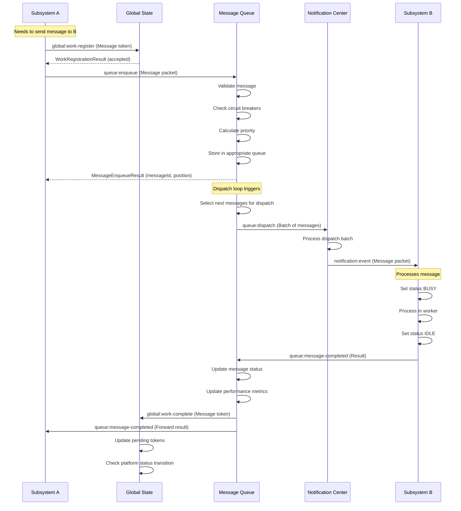
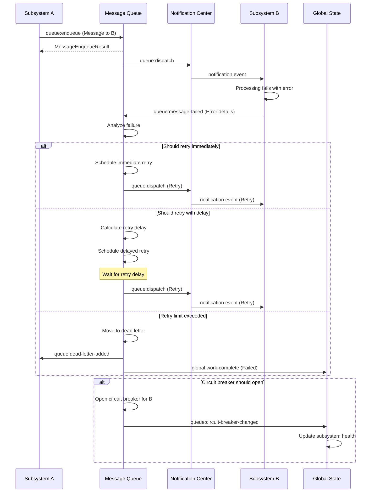
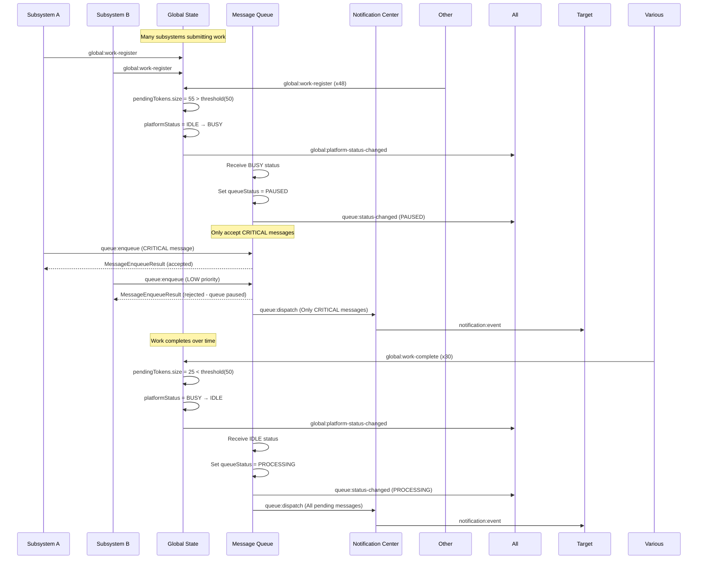
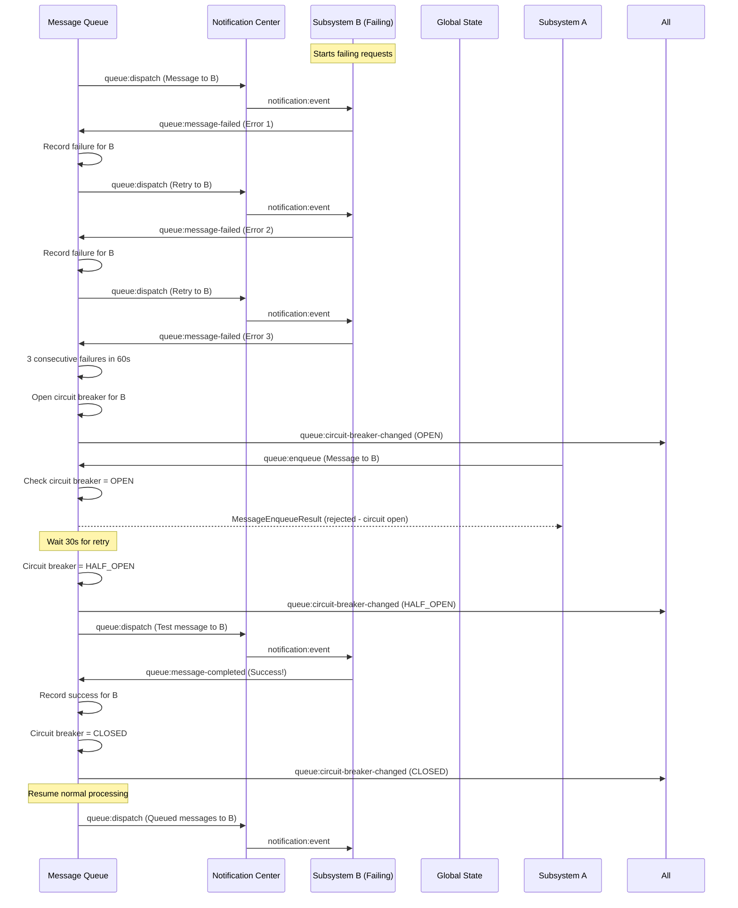
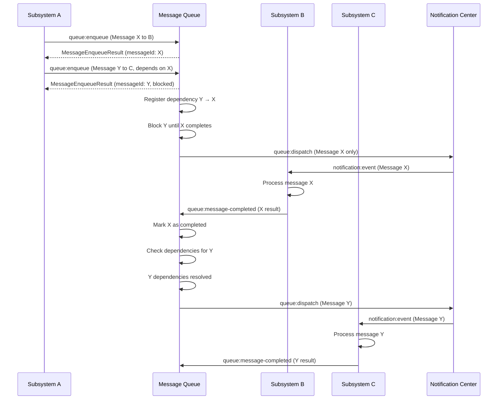
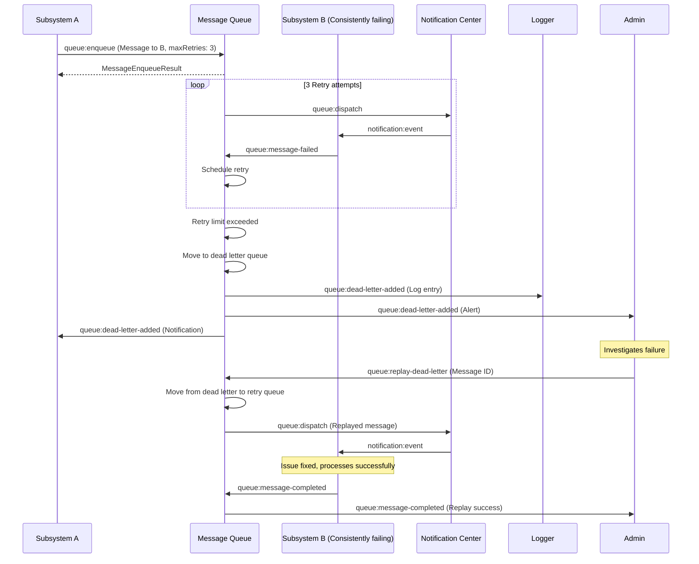
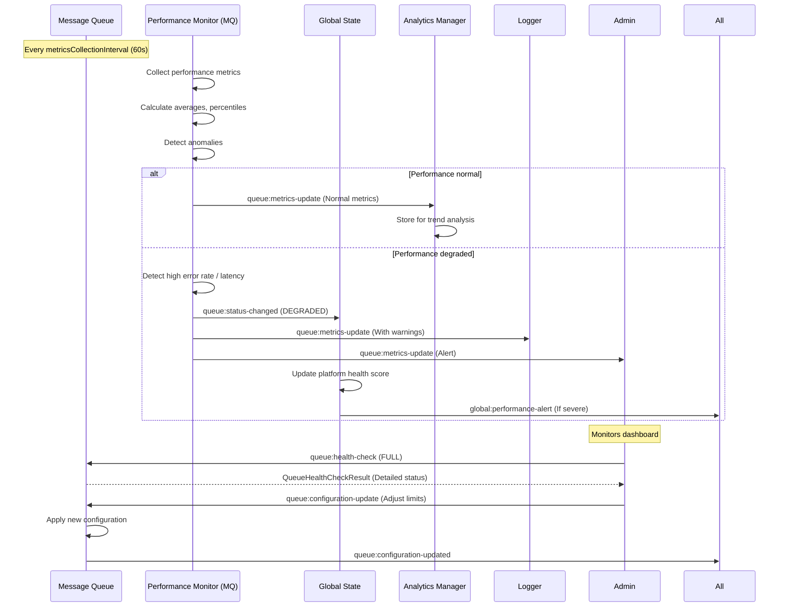

# Message Queue Manager
- Use the `navigator.locks` API for locking requests to the queue
- The main design is the aws sqs model
- The `MessageChannel` will be used for this, but additional features will be built into it to facilitate priority-based message queuing. This creates a distinction between the queue and the `MessageChannel` letting it standout and giving devs a reason to use it over `MessageChannel`

## Initial Proposal
Manages message packets between subsystems. It allows for prioritised scheduling of packets based on their importance/priority/weight. It also allows for queuing of packets when the platform is offline or busy. The packets can be represented as actions communicated between subsystems.

It also emits specialized events to the global state with packet id by adding the packet id to the pending tokens

Each packet must follow an interface for declaring it's states, and packets may be validated (depending on the implementation) for illegal properties before being accepted into the queue. Each packet must be provide their finger prints. The message queue adds it own finger print to the packet when it accepts it into the queue, when they are delayed, dispatched or failed.

The queue itself is a priority queue and it computes the priority of it's elements from the `importance`, `priority` or `weight` defined in the packet and the sender's subsystem. queue is polled by the notification center to dispatch packets to their respective target subsystems.

This subsystem is the fulcrum as it immediately calls the notification center to dispatch packets to their target subsystems as soon as packets are available in the queue and the platform is online and idle.
### Message packets
A message packet is the payload that was created and then passed to the listener. This is the one of the major part the way subsystems interact with one another. A basic packet contains:
- The event id for the event to be fired by the notification center. Note the actual event name to be called is given notification center that has a map of names to event ids
- The on-complete callback with the proper error payload

All packets have their fingerprints are logged to the Logger subsystem when they have their on-complete is called

All packets must define an on-error, on-log and on-complete. With the exception of on-log, all these events adds finger prints in the order that they occured. on-log only has the finger print array as the payload

Note that packages that must contain elevated privilege tokens must include them

#### Fingerprint
An array of fingerprints in the exact order that they were recorded. The finger print of the packet is a list of actions taken when assembling the packet. This will help when the logging subsystem is engaged to provide better insights on packet flow.

Each subsystem must define a fingerprint manager which can attach define a finger from a single action of handling a packet and can also strip the fingerprints if needed.
Each fingerprint contains:
- Action name (completed, error, etc)
- Value type
- Timestamp
- Subsystem id
- Component id (State property name, Feature name, Worker url, etc) (nullable)
- Counter, the number of times this same action was repeated with the same result (nullable)
- Level: The log level for this fingerprint.
- message (nullable)


### States
- The priority queue that holds the packets
- The settings for the queue such as:
    - max size
    - retry attempts
    - retry interval
    - packet schema (for validation)
### Features
- Packet Validator: Provides methods for validating packets against the defined schema
- Priority Scheduler: Provides methods for scheduling packets based on their importance/priority/weight
- Queue Manager: Provides methods for enqueueing, dequeueing, and managing the packet queue
- Retry Manager: Provides methods for retrying failed packets based on the defined retry attempts and interval
- Finger Print Manager: Provides methods for managing the finger prints of packets
- Pending Tokens Notifier: Notifies the global state with a work id of the item added to the queue as the pending token
### Life Cycle Manager
- Initializes the features by calling their respective initialization routines
- Destructs the features by calling their respective destruction routines. Note that it auto shutsdown (dropping all items) when the global state is stopped
### Worker
Manages the packets and queue and are defined by their respective features
### Dependencies
- Notification center for dispatching packets to target subsystems
- Global state for checking platform status (online/idle)
### Control-interface
- Queue length getter
### Message packets
- Must follow the packet interface defined in the queue settings

## Initial Proposal - 2

**Type**: Centralized  
**Importance/Priority/Weight**: **CRITICAL** - Central nervous system for all inter-subsystem communication and work coordination

The Message Queue subsystem serves as the central dispatch system for all inter-subsystem communication within the platform. It implements a priority-based queuing mechanism that coordinates the flow of messages between subsystems while respecting platform resource constraints, subsystem health, and business priorities. As the primary work coordinator, it maintains the integrity of message delivery, implements retry logic, and provides comprehensive observability into platform communication patterns.

---

### States

The state object maintains comprehensive queue and message state with strict consistency guarantees:

#### Queue Core State
- **queueStatus**: Enum (`INITIALIZING`, `IDLE`, `PROCESSING`, `PAUSED`, `DRAINING`, `STOPPED`, `ERROR`)
  - `INITIALIZING`: Queue bootstrapping in progress
  - `IDLE`: No messages pending, ready for new messages
  - `PROCESSING`: Actively dispatching messages to subsystems
  - `PAUSED`: Temporarily halted (due to platform BUSY, errors, or manual pause)
  - `DRAINING`: Processing remaining messages during shutdown
  - `STOPPED`: Graceful shutdown complete, no new messages accepted
  - `ERROR`: Unrecoverable error, requires intervention

- **queues**: Map of priority levels to data structures
    ```typescript
    interface QueueTopology {
    // Immediate execution, bypassing standard checks if possible
    CRITICAL: PriorityQueue<QueueItem>;

    // Standard high-priority user interactions
    HIGH: PriorityQueue<QueueItem>;

    // Background processes, syncs, logs
    MEDIUM: FIFOQueue<QueueItem>;

    // Analytics, pre-fetching, cleanup
    LOW: FIFOQueue<QueueItem>;

    // Failed packets waiting for retry
    RETRY: Map<string, RetryableItem>; // packetId -> Packet

    // Packets that failed maxRetries
    DEAD_LETTER: Array<FailedItem>;
    }
    interface QueueInfo {
        subsystemId: string;
        priorityLevel: 'CRITICAL' | 'HIGH' | 'MEDIUM' | 'LOW';
        messageCount: number;
        oldestMessageTimestamp: number | null;
        estimatedProcessingTime: number | null;
        isPaused: boolean;
        pauseReason: string | null;
    }
    interface QueueItem {
        packet: BaseMessagePacket; // See Message Packets section
        enqueuedAt: number;
        attempts: number;
        priorityScore: number; // Computed from importance + dependencies
        fingerprint: Fingerprint[]; // Accumulated fingerprints
    }
    ```

- **activeMessages**: `Map<string, ActiveMessage>` - Messages currently being processed. Organized by subsystem and priority
  ```typescript
  interface ActiveMessage {
    messageId: string;
    packet: MessagePacket;
    subsystemId: string;
    processingStarted: number;
    timeoutId: NodeJS.Timeout | null;
    retryCount: number;
    lastDispatcherId: string | null; // Notification center instance
    processingPromise: Promise<any> | null;
  }
  ```

#### Configuration & Limits
- **queueConfiguration**: Object containing runtime configuration
  ```typescript
  interface QueueConfiguration {
    // Queue limits
    maxQueueSize: number; // Total messages across all queues
    maxQueueSizePerSubsystem: number; // Per-subsystem limit
    maxActiveMessages: number; // Concurrent processing limit
    maxRetryAttempts: number; // Default retry attempts per message
    maxMessageAge: number; // Max age before discarding (ms)
    
    // Processing configuration
    processingTimeout: number; // Default timeout per message (ms)
    batchSize: number; // Max messages per batch dispatch
    dispatchInterval: number; // Interval between dispatch cycles (ms)
    
    // Retry configuration
    retryStrategy: 'IMMEDIATE' | 'LINEAR' | 'FIXED_DELAY' | 'EXPONENTIAL_BACKOFF' | 'CUSTOM';
    retryDelayBase: number; // Base delay for exponential backoff (ms)
    retryDelayMultiplier: number;
    
    // Dead letter queue
    enableDeadLetterQueue: boolean;
    deadLetterMaxSize: number;
    deadLetterRetentionDays: number;
    
    // Performance optimization
    enableBatching: boolean;
    enableCompression: boolean;
    enableDeduplication: boolean;
    deduplicationWindow: number; // Time window for deduplication (ms)
    
    // Monitoring
    enableDetailedLogging: boolean;
    enablePerformanceMetrics: boolean;
    metricsCollectionInterval: number; // ms
    
    // Circuit breaker
    enableCircuitBreaker: boolean;
    circuitBreakerThreshold: number; // Errors before opening
    circuitBreakerResetTimeout: number; // ms
  }
  ```

#### Performance Metrics
- **performanceMetrics**: Object containing queue performance data
  ```typescript
  interface QueuePerformanceMetrics {
    // Throughput
    messagesProcessedTotal: number;
    messagesProcessedLastMinute: number;
    messagesEnqueuedTotal: number;
    messagesFailedTotal: number;
    messagesRetriedTotal: number;
    
    // Timing
    averageProcessingTime: number;
    averageQueueTime: number;
    p95ProcessingTime: number;
    p99ProcessingTime: number;
    
    // Queue depths
    currentQueueDepth: number;
    maxQueueDepth: number;
    averageQueueDepth: number;
    
    // Error rates
    errorRateLastMinute: number;
    errorRateTotal: number;
    deadLetterCount: number;
    
    // Subsystem-specific metrics
    subsystemMetrics: Map<string, {
      messagesProcessed: number;
      averageProcessingTime: number;
      errorCount: number;
      lastProcessed: number | null;
    }>;
    
    // Resource usage
    memoryUsage: {
      heapUsed: number | null;
      heapTotal: number | null;
      queueMemory: number; // Estimated memory used by queues
    };
    
    // Last updated
    lastMetricsUpdate: number;
  }
  ```

#### Dependency & Ordering Management
- **dependencyGraph**: `DirectedGraph<string>` - Message dependency relationships
- **messageOrderLocks**: `Map<string, Set<string>>` - Messages blocked by dependencies
- **processingOrder**: `Map<string, number>` - Sequence numbers for ordered processing

#### Circuit Breaker State
- **circuitBreakers**: `Map<string, SubsystemCircuitBreaker>` - Per-subsystem circuit breakers
  ```typescript
  interface SubsystemCircuitBreaker {
    subsystemId: string;
    status: 'CLOSED' | 'OPEN' | 'HALF_OPEN';
    failureCount: number;
    successCount: number;
    lastFailure: number | null;
    lastSuccess: number | null;
    consecutiveFailures: number;
    nextRetryTime: number | null;
    errorHistory: Array<{
      error: Error;
      timestamp: number;
      messageId: string;
    }>;
  }
  ```

#### Subscription & Routing State
- **subsystemSubscriptions**: `Map<string, Set<string>>` - Subsystem to event subscriptions
- **eventRoutes**: `Map<symbol, Array<string>>` - Event ID to target subsystem routes
- **filteredRoutes**: `Map<string, Array<RouteFilter>>` - Conditional routing rules

---

### Features

#### Queue Manager
**Purpose**: Core queue management and coordination

**Responsibilities**:
- Manages multiple priority queues for different subsystems
- Implements priority-based enqueueing and dequeueing
- Maintains queue depth limits and overflow handling
- Coordinates between retry, dead letter, and main queues
- Provides atomic queue operations with rollback capabilities

**State Fields**: `queues`, `queueStatus`, `activeMessages`

**Key Methods**:
- `enqueue(packet: MessagePacket): MessageRegistrationResult`
- `dequeue(count: number): MessagePacket[]`
- `getQueueDepth(subsystemId?: string): number`
- `pauseQueue(subsystemId: string, reason: string): void`
- `resumeQueue(subsystemId: string): void`
- `getNextMessages(maxCount: number): MessagePacket[]`

**Weight**: CRITICAL - Core queue operations

---

#### Message Validator
**Purpose**: Validates incoming messages against schemas and rules

**Responsibilities**:
- Validates message structure against registered schemas
- Checks message size limits and content constraints
- Verifies sender permissions and authentication
- Validates dependency declarations
- Detects duplicate messages within deduplication window

**State Fields**: None (stateless validator)

**Key Methods**:
- `validateMessage(packet: MessagePacket): ValidationResult`
- `registerSchema(eventId: symbol, schema: JSONSchema): void`
- `validatePermissions(packet: MessagePacket): boolean`
- `checkForDuplicates(packet: MessagePacket): string | null` // Returns duplicate message ID if found

**Weight**: HIGH - Data integrity and security

---

#### Priority Scheduler
**Purpose**: Determines processing order based on multiple factors

**Responsibilities**:
- Calculates message priority based on importance, dependencies, and age
- Implements priority inheritance for blocked messages
- Schedules retry attempts with appropriate delays
- Manages starvation prevention for low-priority messages
- Adjusts priorities dynamically based on system load

**State Fields**: `processingOrder`, `messageOrderLocks`

**Key Methods**:
- `calculatePriority(packet: MessagePacket): number`
- `updateMessagePriorities(): void`
- `getProcessingOrder(messages: MessagePacket[]): MessagePacket[]`
- `checkDependenciesResolved(messageId: string): boolean`
- `calculateRetryDelay(retryCount: number): number`

**Weight**: HIGH - Performance critical

---

#### Retry Manager
**Purpose**: Manages retry logic for failed messages

**Responsibilities**:
- Implements configurable retry strategies (immediate, fixed, exponential)
- Schedules retry attempts based on error type and subsystem health
- Manages retry queue with priority scheduling
- Tracks retry limits and moves to dead letter when exceeded
- Implements circuit breaker integration for failing subsystems

**State Fields**: `retryQueue`, `circuitBreakers`

**Key Methods**:
- `scheduleRetry(messageId: string, error: Error): void`
- `processRetryQueue(): void`
- `shouldRetry(messageId: string, error: Error): boolean`
- `getRetryCount(messageId: string): number`
- `resetRetryCount(messageId: string): void`

**Weight**: HIGH - System resilience

---

#### Dead Letter Manager
**Purpose**: Manages unrecoverable failed messages

**Responsibilities**:
- Moves messages to dead letter queue after retry exhaustion
- Provides dead letter queue inspection and management
- Implements dead letter retention policies
- Generates alerts for dead letter additions
- Supports message replay from dead letter queue

**State Fields**: `deadLetterQueue`

**Key Methods**:
- `moveToDeadLetter(messageId: string, finalError: Error): void`
- `getDeadLetterMessages(filters?: DeadLetterFilter): DeadLetterMessage[]`
- `replayDeadLetterMessage(messageId: string): boolean`
- `clearDeadLetterMessages(olderThan?: number): number`
- `analyzeDeadLetterPatterns(): DeadLetterAnalysis`

**Weight**: MEDIUM - Error handling and observability

---

#### Dependency Manager
**Purpose**: Manages message dependencies and ordering constraints

**Responsibilities**:
- Tracks message dependencies declared in packets
- Enforces processing order based on dependencies
- Detects and breaks circular dependencies
- Optimizes dependency resolution for parallel processing
- Provides dependency visualization and debugging

**State Fields**: `dependencyGraph`, `messageOrderLocks`

**Key Methods**:
- `registerDependencies(messageId: string, dependencies: string[]): void`
- `resolveDependencies(messageId: string): string[]` // Returns resolved dependency IDs
- `checkCircularDependencies(messageId: string): string[] | null`
- `releaseDependencies(messageId: string): void`
- `getDependencyChain(messageId: string): string[]`

**Weight**: MEDIUM - Complex workflow support

---

#### Circuit Breaker Manager
**Purpose**: Implements circuit breaker pattern for failing subsystems

**Responsibilities**:
- Monitors subsystem error rates and health
- Opens circuit breakers for consistently failing subsystems
- Implements half-open state for gradual recovery
- Provides circuit breaker status to priority scheduler
- Integrates with Global State subsystem health tracking

**State Fields**: `circuitBreakers`

**Key Methods**:
- `checkCircuitBreaker(subsystemId: string): CircuitBreakerStatus`
- `recordSuccess(subsystemId: string): void`
- `recordFailure(subsystemId: string, error: Error): void`
- `shouldOpenCircuitBreaker(subsystemId: string): boolean`
- `resetCircuitBreaker(subsystemId: string): void`

**Weight**: HIGH - System stability

---

#### Performance Monitor
**Purpose**: Tracks queue performance and generates metrics

**Responsibilities**:
- Collects real-time performance metrics
- Calculates throughput, latency, and error rates
- Detects performance anomalies and bottlenecks
- Generates alerts for performance degradation
- Provides metrics to Analytics Manager

**State Fields**: `performanceMetrics`

**Key Methods**:
- `recordMessageProcessed(messageId: string, processingTime: number): void`
- `recordMessageFailed(messageId: string, error: Error): void`
- `calculatePerformanceMetrics(): QueuePerformanceMetrics`
- `detectPerformanceAnomalies(): PerformanceAnomaly[]`
- `generatePerformanceReport(timeRange: TimeRange): PerformanceReport`

**Weight**: MEDIUM - Observability

---

#### Compression Manager
**Purpose**: Compresses and decompresses message payloads

**Responsibilities**:
- Compresses large message payloads before queuing
- Decompresses messages before dispatch
- Selects optimal compression algorithm based on content
- Tracks compression ratios and performance impact
- Provides fallback for unsupported compression

**State Fields**: None (stateless)

**Key Methods**:
- `compressPacket(packet: MessagePacket): MessagePacket`
- `decompressPacket(packet: MessagePacket): MessagePacket`
- `shouldCompress(packet: MessagePacket): boolean`
- `getCompressionRatio(packet: MessagePacket): number`

**Weight**: LOW - Performance optimization

---

#### Batch Manager
**Purpose**: Manages message batching for efficiency

**Responsibilities**:
- Groups related messages into batches
- Implements batch size limits and flushing
- Maintains batch ordering guarantees
- Handles partial batch failures
- Provides batch-aware scheduling

**State Fields**: None (stateless)

**Key Methods**:
- `createBatch(messages: MessagePacket[]): Batch`
- `addToBatch(message: MessagePacket, batchId: string): boolean`
- `flushBatch(batchId: string): MessagePacket[]`
- `shouldBatch(messages: MessagePacket[]): boolean`
- `splitLargeBatch(batch: Batch): Batch[]`

**Weight**: LOW - Performance optimization

---

### Life Cycle Manager

#### Initialization Sequence

The Message Queue initializes after Global State and before Notification Center:

1. **Pre-initialization Phase**
   ```javascript
   // Wait for Global State to be ready
   - Subscribe: global:initialized
   - Validate: Global State platformStatus === 'IDLE'
   - Set queueStatus = 'INITIALIZING'
   ```

2. **Configuration Loading**
   ```javascript
   // Load configuration from Storage Manager
   - Send: storage:query for message queue configuration
   - Apply default configuration for missing values
   - Validate configuration consistency
   - Initialize queueConfiguration state
   ```

3. **State Initialization**
   ```javascript
   // Initialize all state structures
   - Initialize empty queues Map
   - Initialize empty messageRegistry
   - Initialize empty activeMessages
   - Initialize empty retryQueue and deadLetterQueue
   - Initialize empty circuitBreakers Map
   - Initialize empty dependencyGraph
   ```

4. **Feature Component Initialization** (ordered by dependency)
   ```javascript
   // Initialize in exact order:
   1. Message Validator (no dependencies)
   2. Circuit Breaker Manager (depends on Global State health)
   3. Priority Scheduler (depends on Circuit Breaker)
   4. Queue Manager (depends on Priority Scheduler)
   5. Dependency Manager (depends on Queue Manager)
   6. Retry Manager (depends on Queue Manager, Circuit Breaker)
   7. Dead Letter Manager (depends on Retry Manager)
   8. Performance Monitor (depends on all above)
   9. Compression Manager (optional, stateless)
   10. Batch Manager (optional, stateless)
   ```

5. **Event Registration**
   ```javascript
   // Register with Notification Center
   - Register all event IDs with action names
   - Create event ID → subsystem routing tables
   - Register subscription for: notification:packet-available
   ```

6. **Recovery Processing**
   ```javascript
   // Recover from previous session
   - Query Storage Manager for pending messages
   - Rebuild messageRegistry from persisted state
   - Reconstruct dependency graph
   - Schedule retry of interrupted messages
   - Recalculate queue depths
   ```

7. **Start Dispatch Loop**
   ```javascript
   // Begin processing messages
   - Start dispatch interval timer
   - Set queueStatus = 'IDLE'
   - Fire: queue:initialized event
   - Log initialization completion
   ```

#### Destruction Sequence

Graceful shutdown follows reverse initialization order:

1. **Initiate Shutdown**
   ```javascript
   // Stop accepting new messages
   - Set queueStatus = 'DRAINING'
   - Fire: queue:draining event
   - Stop dispatch interval timer
   ```

2. **Process Remaining Messages**
   ```javascript
   // Allow in-flight messages to complete
   - Wait for activeMessages to empty (max 30s timeout)
   - Cancel remaining timeout handlers
   - Move unprocessable messages to dead letter
   ```

3. **Persist State**
   ```javascript
   // Save current state for recovery
   - Send: storage:create with queue state snapshot
   - Persist: messageRegistry, retryQueue, deadLetterQueue
   - Record: Last processed message IDs
   ```

4. **Destruct Features** (reverse initialization order)
   ```javascript
   10. Batch Manager
   9. Compression Manager
   8. Performance Monitor
   7. Dead Letter Manager
   6. Retry Manager
   5. Dependency Manager
   4. Queue Manager
   3. Priority Scheduler
   2. Circuit Breaker Manager
   1. Message Validator
   ```

5. **Final Cleanup**
   ```javascript
   // Clear all state
   - Clear all queues and maps
   - Nullify state object
   - Set queueStatus = 'STOPPED'
   - Fire: queue:stopped event
   ```

---

### Worker

**Type**: Hybrid (Virtual Worker with Physical Worker for compression)

The Message Queue uses a Virtual Worker pattern on the main thread for synchronous operations, with optional Physical Worker for CPU-intensive tasks like compression and batch processing.

#### Virtual Worker Components

**Receiver** (Event Handlers):
- `onMessageEnqueued(packet: MessagePacket): void`
- `onNotificationReady(notification: DispatchNotification): void`
- `onMessageCompleted(messageId: string, result: any): void`
- `onMessageFailed(messageId: string, error: Error): void`
- `onGlobalStateChange(state: GlobalState): void`

**Processor** (State Mutations):
- `processEnqueue(packet: MessagePacket): MessageRegistrationResult`
- `processDispatch(maxCount: number): MessagePacket[]`
- `processCompletion(messageId: string, result: any): void`
- `processFailure(messageId: string, error: Error): void`
- `processPriorityUpdate(): void`

**Dispatcher** (Event Broadcasts):
- `dispatchMessagesToNotification(messages: MessagePacket[]): void`
- `broadcastQueueStatusChange(oldStatus: QueueStatus, newStatus: QueueStatus): void`
- `sendMetricsToAnalytics(metrics: QueuePerformanceMetrics): void`
- `notifySubsystemHealthChange(subsystemId: string, health: number): void`

#### Physical Worker (Optional)

Used for CPU-intensive operations:

**Compression Worker**:
- Compresses/decompresses large message payloads
- Implements multiple compression algorithms (gzip, brotli, lz4)
- Benchmarks compression performance

**Batch Processing Worker**:
- Analyzes message relationships for optimal batching
- Calculates batch sizes and composition
- Processes batch failure recovery

#### Worker Requirements

**Pausable/Resumable**:
- Can pause processing during platform BUSY state
- Resumes from checkpoint after pause
- Maintains message ordering guarantees

**Error Isolation**:
- Worker failures don't crash main queue
- Automatic restart with state recovery
- Graceful degradation to virtual worker

**Resource Management**:
- Adaptive compression based on CPU load
- Memory limits for queue buffers
- Connection pooling for external services

---

### Dependencies

**Initialization Priority**: After Global State, before Notification Center

#### Required Dependencies

1. **Global State** (CRITICAL)
   - **Purpose**: Platform status, subsystem health, work coordination
   - **Usage**:
     - Check `platformStatus` before accepting messages
     - Register pending work tokens for message processing
     - Subscribe to subsystem health changes for circuit breaking
     - Coordinate with platform BUSY/IDLE states
   - **Initialization**: Must be READY before Message Queue initializes

2. **Storage Manager** (HIGH)
   - **Purpose**: Configuration persistence, message recovery
   - **Usage**:
     - Load queue configuration and schemas
     - Persist message state for crash recovery
     - Store dead letter queue for analysis
     - Backup dependency graphs
   - **Initialization**: Should be READY before Message Queue completes initialization

3. **Notification Center** (CRITICAL)
   - **Purpose**: Message dispatch and event coordination
   - **Usage**:
     - Dispatch messages to target subsystems
     - Receive message completion/failure notifications
     - Coordinate with multiple notification center instances
     - Broadcast queue status changes
   - **Initialization**: Initializes after Message Queue, bidirectional dependency

4. **Logger** (MEDIUM)
   - **Purpose**: Audit trail, error logging, performance metrics
   - **Usage**:
     - Log all message lifecycle events
     - Record queue performance metrics
     - Audit trail for security-critical messages
     - Error logging for failed messages
   - **Initialization**: Should be READY during Message Queue initialization

5. **Auth Manager** (MEDIUM)
   - **Purpose**: Message authentication and authorization
   - **Usage**:
     - Validate message sender permissions
     - Check elevation tokens for protected operations
     - Authenticate inter-subsystem communication
     - Audit security-critical message flows
   - **Initialization**: Should be READY before processing authenticated messages

#### Optional Dependencies

6. **Analytics Manager** (LOW)
   - **Purpose**: Performance metrics and trend analysis
   - **Usage**:
     - Send queue performance metrics
     - Analyze message flow patterns
     - Generate capacity planning reports
   - **Initialization**: Can initialize after Message Queue

7. **Network Request Manager** (LOW)
   - **Purpose**: External queue integrations
   - **Usage**:
     - Forward messages to external queues (SQS, RabbitMQ)
     - Fetch remote queue configurations
     - Synchronize with cloud queue services
   - **Initialization**: Optional, for advanced integrations

#### Functional Predicates

```javascript
/**
 * Determines if a message can be accepted based on platform state
 */
function canAcceptMessage(packet: MessagePacket): boolean {
  const globalState = getGlobalState();
  
  // Check platform status
  if (globalState.platformStatus === 'STOPPED' || 
      globalState.platformStatus === 'CRASHED') {
    return false;
  }
  
  // Check platform BUSY state
  if (globalState.platformStatus === 'BUSY' && 
      packet.importance !== 'CRITICAL') {
    return false;
  }
  
  // Check subsystem health
  const targetSubsystem = getTargetSubsystem(packet);
  if (!globalState.isSubsystemHealthy(targetSubsystem)) {
    return false;
  }
  
  // Check circuit breaker
  const cb = state.circuitBreakers.get(targetSubsystem);
  if (cb && cb.status === 'OPEN') {
    return false;
  }
  
  // Check queue limits
  if (state.queues.get(targetSubsystem)?.messageCount > 
      state.queueConfiguration.maxQueueSizePerSubsystem) {
    return false;
  }
  
  return true;
}

/**
 * Determines if a message should be dispatched immediately
 */
function shouldDispatchImmediately(packet: MessagePacket): boolean {
  return packet.importance === 'CRITICAL' ||
         packet.payload.urgent === true ||
         state.queueStatus === 'DRAINING';
}

/**
 * Determines if a message failure should trigger circuit breaker
 */
function shouldTriggerCircuitBreaker(subsystemId: string, error: Error): boolean {
  const cb = state.circuitBreakers.get(subsystemId);
  if (!cb) return false;
  
  // Check error type
  const isNetworkError = error.name.includes('Network') || 
                         error.name.includes('Timeout');
  const isAuthError = error.name.includes('Auth') || 
                      error.name.includes('Permission');
  
  // Different thresholds for different error types
  if (isNetworkError) {
    return cb.consecutiveFailures >= 3;
  } else if (isAuthError) {
    return cb.consecutiveFailures >= 1; // Immediate for auth errors
  } else {
    return cb.consecutiveFailures >= 5;
  }
}

/**
 * Determines optimal batch size based on system load
 */
function calculateOptimalBatchSize(): number {
  const globalState = getGlobalState();
  const memoryPressure = globalState.performanceMetrics.memoryUsage.heapUsed / 
                        globalState.performanceMetrics.memoryUsage.heapTotal;
  
  if (memoryPressure > 0.8) {
    return 1; // Small batches under memory pressure
  } else if (state.queueStatus === 'PROCESSING') {
    return state.queueConfiguration.batchSize;
  } else {
    return Math.min(state.queueConfiguration.batchSize, 10);
  }
}
```

---

### Control Interface

#### Getters (No-arg)

###### Queue Status
- `getQueueStatus(): QueueStatus` - Current queue operational status
- `getQueueDepth(subsystemId?: string): number` - Message count in queue
- `getActiveMessageCount(): number` - Currently processing messages
- `getRetryQueueDepth(): number` - Messages scheduled for retry
- `getDeadLetterCount(): number` - Messages in dead letter queue
- `isQueuePaused(subsystemId: string): boolean` - Check if queue is paused

###### Performance Metrics
- `getPerformanceMetrics(): QueuePerformanceMetrics` - Comprehensive metrics
- `getThroughput(): number` - Messages processed per minute
- `getAverageProcessingTime(): number` - Average processing time (ms)
- `getErrorRate(): number` - Error percentage (0-100)
- `getOldestMessageAge(): number | null` - Age of oldest pending message (ms)

###### Message Information
- `getMessageStatus(messageId: string): MessageStatus | null` - Current message status
- `getMessagePosition(messageId: string): number | null` - Position in queue
- `getEstimatedWaitTime(messageId: string): number | null` - Estimated wait time (ms)
- `getMessageHistory(messageId: string): StatusHistory[]` - Complete status history

###### Subsystem Information
- `getSubsystemQueueInfo(subsystemId: string): QueueInfo | null` - Subsystem queue details
- `getCircuitBreakerStatus(subsystemId: string): CircuitBreakerStatus` - Circuit breaker state
- `getSubsystemErrorRate(subsystemId: string): number` - Error rate for subsystem

###### Configuration
- `getQueueConfiguration(): QueueConfiguration` - Current configuration
- `getQueueLimits(): QueueLimits` - Current size and rate limits
- `isFeatureEnabled(feature: string): boolean` - Check if feature is enabled

#### Setters

###### Queue Control
- `pauseQueue(subsystemId: string, reason: string): void` - Pause specific queue
- `resumeQueue(subsystemId: string): void` - Resume paused queue
- `setQueuePriority(subsystemId: string, priority: number): void` - Adjust queue priority
- `setProcessingRate(rate: number): void` - Set messages per second limit

###### Configuration
- `updateConfiguration(updates: Partial<QueueConfiguration>): void` - Update queue config
- `setMaxQueueSize(size: number): void` - Set maximum queue size
- `setRetryStrategy(strategy: RetryStrategy): void` - Change retry strategy
- `setCircuitBreakerThreshold(threshold: number): void` - Adjust circuit breaker sensitivity

#### Actions (Fire events to message queue)

###### Message Management
- `enqueueMessage(packet: MessagePacket): EnqueueResult` - Add message to queue
  ```javascript
  // Returns: { success: boolean, messageId: string, position: number, estimatedWaitTime: number }
  ```

- `dequeueMessage(messageId: string): boolean` - Remove message from queue
- `prioritizeMessage(messageId: string, newPriority: number): boolean` - Change message priority
- `cancelMessage(messageId: string, reason: string): boolean` - Cancel pending message

###### Queue Operations
- `flushQueue(subsystemId: string): FlushResult` - Process all pending messages
  ```javascript
  // Returns: { messagesProcessed: number, errors: number, duration: number }
  ```

- `clearQueue(subsystemId: string, filter?: MessageFilter): ClearResult` - Clear messages matching filter
- `replayQueue(fromTimestamp: number, toTimestamp: number): ReplayResult` - Replay historical messages

###### Retry & Dead Letter
- `retryFailedMessage(messageId: string): boolean` - Manually retry failed message
- `retryAllFailedMessages(subsystemId?: string): RetryAllResult` - Retry all failed messages
- `replayDeadLetterMessage(messageId: string): boolean` - Replay from dead letter
- `analyzeDeadLetterPatterns(): DeadLetterAnalysis` - Analyze failure patterns

###### Maintenance
- `compactQueue(): CompactResult` - Remove expired and completed messages
- `rebalanceQueues(): RebalanceResult` - Rebalance messages across queues
- `resetStatistics(): void` - Reset performance counters
- `exportQueueState(): QueueStateExport` - Export complete queue state

#### Subscriptions (Subscribe to notification center events)

###### Global State Events
- `global:platform-status-changed` - React to platform status changes
- `global:subsystem-status-changed` - Update subsystem health status
- `global:work-started` - Track work tokens for messages
- `global:work-completed` - Complete work tokens for messages

###### Subsystem Events
- `*:message-completed` - Receive message completion notifications
- `*:message-failed` - Receive message failure notifications
- `*:subsystem-ready` - React to subsystem readiness
- `*:subsystem-busy` - Adjust dispatching to busy subsystems

###### Notification Center Events
- `notification:packet-available` - Signal that messages can be dispatched
- `notification:dispatch-complete` - Confirm message dispatch
- `notification:dispatch-failed` - Handle dispatch failures

###### Storage Events
- `storage:quota-warning` - Adjust queue behavior under storage pressure
- `storage:operation-failed` - Handle storage-related failures

---

### Message Packets

#### Type Definitions

```typescript
/**
 * Shared Type Definitions
 */
export type Importance = 'CRITICAL' | 'HIGH' | 'MEDIUM' | 'LOW';
export type QueueStatus = 'INITIALIZING' | 'IDLE' | 'PROCESSING' | 'PAUSED' | 'DRAINING' | 'STOPPED' | 'ERROR';
export type MessageStatus = 'PENDING' | 'DISPATCHING' | 'PROCESSING' | 'COMPLETED' | 'FAILED' | 'RETRYING' | 'DEAD_LETTER';

export interface Fingerprint {
  actionName: string;
  valueType: string;
  timestamp: number;
  subsystemId: string;
  componentId: string | null;
  counter: number | null;
  level: 'INFO' | 'WARN' | 'ERROR' | 'DEBUG' | 'FATAL';
  message: string | null;
}

export interface BasePacket<P, R = any> {
  eventId: symbol;
  actionName: string;
  payload: P;
  importance: Importance;
  onComplete: (result: R) => void;
  onError: (error: Error) => void;
  onLog: ((fingerprints: Fingerprint[]) => void) | null;
  fingerprints: Fingerprint[];
  authToken?: string; // For elevated access
  retryable?: boolean; // Default: true
  metadata: {
    messageId: string;
    sourceSubsystem: string;
    targetSubsystem: string;
    timestamp: number;
    ttl?: number; // Time to live (ms)
    dependencies?: string[]; // Message IDs this message depends on
    correlationId?: string; // For tracing across systems
    traceId?: string; // Distributed tracing ID
    spanId?: string; // Individual operation ID
  };
}
```

#### 1. Message Enqueue Packet

Sent to enqueue a new message for processing.

```typescript
export interface MessageEnqueuePayload {
  packet: Omit<BasePacket<any, any>, 'metadata'>; // Original packet without metadata
  options: {
    immediateDispatch?: boolean;
    bypassValidation?: boolean;
    bypassCircuitBreaker?: boolean;
    maxRetries?: number;
    timeout?: number;
    priorityOverride?: number;
    orderingKey?: string; // For ordered processing
    deduplicationId?: string; // For deduplication
  };
}

export interface MessageEnqueueResult {
  success: boolean;
  messageId: string;
  queuePosition: number;
  estimatedWaitTime: number;
  queueDepth: number;
  subsystemQueueInfo: QueueInfo;
}

export type MessageEnqueuePacket = BasePacket<MessageEnqueuePayload, MessageEnqueueResult>;

// Event ID: queue:enqueue
// Importance: MEDIUM (or from original packet)
// Broadcast: No
```

#### 2. Message Dispatch Packet

Internal packet for dispatching messages to Notification Center.

```typescript
export interface MessageDispatchPayload {
  messages: Array<{
    messageId: string;
    packet: BasePacket<any, any>;
    retryCount: number;
    attemptNumber: number;
  }>;
  batchId: string;
  dispatcherId: string; // Notification center instance
  timestamp: number;
}

export interface MessageDispatchResult {
  batchId: string;
  messagesDispatched: number;
  dispatchTime: number;
  nextDispatchEstimate: number;
}

export type MessageDispatchPacket = BasePacket<MessageDispatchPayload, MessageDispatchResult>;

// Event ID: queue:dispatch
// Importance: HIGH
// Broadcast: Yes (to Notification Center)
```

#### 3. Message Completion Packet

Sent when a message processing completes successfully.

```typescript
export interface MessageCompletionPayload {
  messageId: string;
  result: any;
  processingTime: number;
  completedBy: string; // Subsystem ID that processed it
  timestamp: number;
}

export type MessageCompletionPacket = BasePacket<MessageCompletionPayload, void>;

// Event ID: queue:message-completed
// Importance: MEDIUM
// Broadcast: Yes (to original sender and interested subsystems)
```

#### 4. Message Failure Packet

Sent when a message processing fails.

```typescript
export interface MessageFailurePayload {
  messageId: string;
  error: {
    name: string;
    message: string;
    stack: string;
    code: string;
    subsystemId: string;
  };
  retryCount: number;
  willRetry: boolean;
  retryScheduledFor: number | null;
  timestamp: number;
}

export type MessageFailurePacket = BasePacket<MessageFailurePayload, void>;

// Event ID: queue:message-failed
// Importance: MEDIUM
// Broadcast: Yes (to original sender and interested subsystems)
```

#### 5. Queue Status Change Packet

Broadcast when queue status changes.

```typescript
export interface QueueStatusChangePayload {
  oldStatus: QueueStatus;
  newStatus: QueueStatus;
  reason: string;
  subsystemId: string | null; // If specific queue
  messageCount: number;
  activeMessages: number;
  timestamp: number;
}

export type QueueStatusChangePacket = BasePacket<QueueStatusChangePayload, void>;

// Event ID: queue:status-changed
// Importance: HIGH
// Broadcast: Yes (all subsystems)
```

#### 6. Circuit Breaker Change Packet

Broadcast when circuit breaker status changes.

```typescript
export interface CircuitBreakerChangePayload {
  subsystemId: string;
  oldStatus: 'CLOSED' | 'OPEN' | 'HALF_OPEN';
  newStatus: 'CLOSED' | 'OPEN' | 'HALF_OPEN';
  failureCount: number;
  consecutiveFailures: number;
  nextRetryTime: number | null;
  reason: string;
  timestamp: number;
}

export type CircuitBreakerChangePacket = BasePacket<CircuitBreakerChangePayload, void>;

// Event ID: queue:circuit-breaker-changed
// Importance: HIGH
// Broadcast: Yes (all subsystems)
```

#### 7. Queue Metrics Packet

Periodic performance metrics broadcast.

```typescript
export interface QueueMetricsPayload {
  metrics: QueuePerformanceMetrics;
  interval: number; // Metrics collection interval (ms)
  timestamp: number;
}

export type QueueMetricsPacket = BasePacket<QueueMetricsPayload, void>;

// Event ID: queue:metrics-update
// Importance: LOW
// Broadcast: Yes (to Analytics Manager and interested subsystems)
```

#### 8. Dead Letter Addition Packet

Sent when a message is moved to dead letter queue.

```typescript
export interface DeadLetterAdditionPayload {
  messageId: string;
  originalPacket: BasePacket<any, any>;
  failureReasons: Array<{
    error: Error;
    timestamp: number;
    retryCount: number;
  }>;
  finalFailureTime: number;
  sourceSubsystem: string;
  targetSubsystem: string;
  processingAttempts: number;
}

export type DeadLetterAdditionPacket = BasePacket<DeadLetterAdditionPayload, void>;

// Event ID: queue:dead-letter-added
// Importance: MEDIUM
// Broadcast: Yes (to Logger and admin subsystems)
```

#### 9. Queue Configuration Update Packet

Sent when queue configuration is updated.

```typescript
export interface QueueConfigurationUpdatePayload {
  oldConfiguration: QueueConfiguration;
  newConfiguration: QueueConfiguration;
  updatedBy: string; // Subsystem ID or 'admin'
  reason: string;
  timestamp: number;
}

export type QueueConfigurationUpdatePacket = BasePacket<QueueConfigurationUpdatePayload, void>;

// Event ID: queue:configuration-updated
// Importance: MEDIUM
// Broadcast: Yes (all subsystems)
```

#### 10. Dependency Resolution Packet

Sent when message dependencies are resolved.

```typescript
export interface DependencyResolutionPayload {
  messageId: string;
  resolvedDependencies: string[];
  unresolvedDependencies: string[];
  isReadyForProcessing: boolean;
  estimatedProcessingTime: number | null;
  timestamp: number;
}

export type DependencyResolutionPacket = BasePacket<DependencyResolutionPayload, void>;

// Event ID: queue:dependencies-resolved
// Importance: LOW
// Broadcast: No (specific to waiting subsystems)
```

#### 11. Queue Health Check Packet

Periodic health check request/response.

```typescript
export interface QueueHealthCheckPayload {
  checkType: 'LIVENESS' | 'READINESS' | 'FULL';
  timestamp: number;
}

export interface QueueHealthCheckResult {
  healthy: boolean;
  queueStatus: QueueStatus;
  messageCount: number;
  oldestMessageAge: number | null;
  errorCount: number;
  recommendations: string[];
  timestamp: number;
}

export type QueueHealthCheckPacket = BasePacket<QueueHealthCheckPayload, QueueHealthCheckResult>;

// Event ID: queue:health-check
// Importance: LOW
// Broadcast: No
```

#### Unified Message Queue Packet Type

```typescript
export type MessageQueuePacket =
  | MessageEnqueuePacket
  | MessageDispatchPacket
  | MessageCompletionPacket
  | MessageFailurePacket
  | QueueStatusChangePacket
  | CircuitBreakerChangePacket
  | QueueMetricsPacket
  | DeadLetterAdditionPacket
  | QueueConfigurationUpdatePacket
  | DependencyResolutionPacket
  | QueueHealthCheckPacket;
```

---

### Inter-Subsystem Communication Flows

#### Flow 1: Normal Message Flow (Subsystem A → Subsystem B)



#### Flow 2: Message Failure with Retry



#### Flow 3: Platform BUSY State Coordination



#### Flow 4: Subsystem Circuit Breaker Pattern



#### Flow 5: Message with Dependencies



#### Flow 6: Dead Letter Queue Management



#### Flow 7: Queue Performance Monitoring



---

### Special Considerations

#### 1. Message Ordering Guarantees

**Challenge**: Maintaining processing order while ensuring performance and resilience.

**Solutions**:
- **Ordering Keys**: Messages with same ordering key processed sequentially
- **Partial Ordering**: Only enforce ordering when explicitly requested
- **Dependency Tracking**: Explicit dependency declarations for complex workflows
- **Order-Aware Retry**: Retry mechanisms preserve ordering

**Implementation**:
```javascript
function ensureOrderedProcessing(messages: MessagePacket[]): MessagePacket[] {
  // Group by ordering key
  const groups = new Map<string, MessagePacket[]>();
  
  messages.forEach(msg => {
    const key = msg.metadata.orderingKey || 'default';
    if (!groups.has(key)) groups.set(key, []);
    groups.get(key)!.push(msg);
  });
  
  // Process groups sequentially, within groups maintain order
  const result: MessagePacket[] = [];
  for (const [key, group] of groups) {
    if (key !== 'default') {
      // For ordered groups, ensure no overlapping processing
      const lock = acquireOrderingLock(key);
      try {
        result.push(...group);
      } finally {
        releaseOrderingLock(key);
      }
    } else {
      // Default group can be processed in any order
      result.push(...group);
    }
  }
  
  return result;
}
```

#### 2. Memory Management for Large Queues

**Challenge**: Queue memory usage growing unbounded under load.

**Strategies**:
- **Bounded Queues**: Configurable maximum size per queue
- **Message Aging**: Automatic expiration of old messages
- **Compression**: Transparent compression of large payloads
- **Spill to Disk**: Offload to IndexedDB when memory limits exceeded
- **Selective Persistence**: Only persist messages that need recovery

**Implementation**:
```javascript
class MemoryAwareQueue {
  private maxMemoryBytes: number;
  private currentMemoryUsage: number = 0;
  private messageSizes = new Map<string, number>();
  
  enqueue(packet: MessagePacket): boolean {
    const estimatedSize = this.estimateMessageSize(packet);
    
    // Check memory limits
    if (this.currentMemoryUsage + estimatedSize > this.maxMemoryBytes) {
      // Try to free memory
      const freed = this.freeMemory(estimatedSize);
      if (!freed) {
        // Spill oldest messages to disk
        this.spillToDisk(estimatedSize);
      }
    }
    
    // Store in memory
    this.currentMemoryUsage += estimatedSize;
    this.messageSizes.set(packet.metadata.messageId, estimatedSize);
    
    return true;
  }
  
  private freeMemory(requiredBytes: number): boolean {
    // Free completed/failed messages first
    const completable = this.getCompletableMessages();
    let freed = 0;
    
    for (const msg of completable) {
      const size = this.messageSizes.get(msg.metadata.messageId) || 0;
      this.messageSizes.delete(msg.metadata.messageId);
      freed += size;
      
      if (freed >= requiredBytes) break;
    }
    
    this.currentMemoryUsage -= freed;
    return freed >= requiredBytes;
  }
}
```

#### 3. Distributed Queue Coordination

**Challenge**: Coordinating multiple queue instances in complex deployments.

**Patterns**:
- **Leader Election**: Single active queue instance with hot standby
- **Sharding**: Messages sharded by subsystem or hash
- **Consistent Hashing**: Predictable message routing across instances
- **Gossip Protocol**: Instance health and load sharing
- **Global State Integration**: Central coordination via Global State

**Implementation**:
```javascript
class DistributedQueueCoordinator {
  private instances = new Map<string, QueueInstance>();
  private shardingAlgorithm: ShardingAlgorithm;
  
  routeMessage(packet: MessagePacket): string {
    // Determine target instance based on sharding
    const shardKey = this.getShardKey(packet);
    const instanceId = this.shardingAlgorithm.getShard(shardKey);
    
    // Check instance health via Global State
    const instanceHealth = globalState.getSubsystemHealth(`queue-${instanceId}`);
    if (instanceHealth < 50) {
      // Redirect to healthy instance
      return this.findHealthyInstance(shardKey);
    }
    
    return instanceId;
  }
  
  private getShardKey(packet: MessagePacket): string {
    // Use target subsystem for sharding
    return packet.metadata.targetSubsystem;
  }
}
```

#### 4. Security & Message Integrity

**Challenge**: Preventing message tampering and ensuring authorized access.

**Measures**:
- **Message Signing**: Digital signatures for critical messages
- **Encryption**: End-to-end encryption for sensitive payloads
- **Permission Validation**: Per-message permission checks
- **Audit Trail**: Complete message lifecycle logging
- **Rate Limiting**: Per-subsystem message rate limits

**Implementation**:
```javascript
class SecureMessageValidator {
  async validateMessage(packet: MessagePacket): Promise<ValidationResult> {
    // 1. Verify message signature
    const signatureValid = await this.verifySignature(packet);
    if (!signatureValid) {
      return { valid: false, reason: 'Invalid signature' };
    }
    
    // 2. Check sender permissions
    const canSend = await this.checkPermissions(
      packet.metadata.sourceSubsystem,
      packet.eventId
    );
    if (!canSend) {
      return { valid: false, reason: 'Insufficient permissions' };
    }
    
    // 3. Validate rate limits
    const withinLimits = this.checkRateLimits(packet);
    if (!withinLimits) {
      return { valid: false, reason: 'Rate limit exceeded' };
    }
    
    // 4. Decrypt if necessary
    if (packet.metadata.encrypted) {
      const decrypted = await this.decryptPayload(packet);
      packet.payload = decrypted;
    }
    
    return { valid: true };
  }
}
```

#### 5. Cross-Browser Compatibility

**Challenge**: Ensuring consistent queue behavior across browsers.

**Adaptations**:
- **Feature Detection**: Detect and adapt to browser capabilities
- **Polyfills**: For missing APIs (Compression API, etc.)
- **Graceful Degradation**: Reduce functionality rather than fail
- **Storage Fallbacks**: Memory-only fallback when IndexedDB unavailable

**Implementation**:
```javascript
class BrowserCompatibleQueue {
  constructor() {
    this.detectCapabilities();
    this.adaptToBrowser();
  }
  
  private detectCapabilities() {
    this.capabilities = {
      compression: 'compression' in window,
      webWorkers: 'Worker' in window,
      indexedDB: 'indexedDB' in window,
      memory: navigator.deviceMemory || 4 // Default to 4GB
    };
  }
  
  private adaptToBrowser() {
    // Adjust configuration based on capabilities
    if (!this.capabilities.compression) {
      this.configuration.enableCompression = false;
    }
    
    if (!this.capabilities.indexedDB) {
      this.configuration.maxQueueSize = 1000; // Reduce for memory-only
      this.configuration.enableDeadLetterQueue = false;
    }
    
    if (this.capabilities.memory < 2) {
      // Low memory device
      this.configuration.maxActiveMessages = 2;
      this.configuration.batchSize = 1;
    }
  }
}
```

#### 6. Testing & Simulation

**Challenge**: Testing distributed, asynchronous queue behavior.

**Strategies**:
- **Deterministic Simulation**: Time-controlled event simulation
- **Chaos Engineering**: Random failure injection
- **Load Testing**: Realistic workload generation
- **Property-Based Testing**: Validate invariants under all conditions
- **Integration Testing**: Full subsystem integration tests

**Implementation**:
```javascript
class QueueTestHarness {
  async runChaosTest(duration: number) {
    const startTime = Date.now();
    
    while (Date.now() - startTime < duration) {
      // Randomly inject failures
      if (Math.random() < 0.01) {
        // Simulate subsystem crash
        this.simulateSubsystemCrash();
      }
      
      if (Math.random() < 0.05) {
        // Simulate network partition
        this.simulateNetworkPartition();
      }
      
      if (Math.random() < 0.1) {
        // Simulate slow processing
        this.simulateSlowProcessing();
      }
      
      // Verify invariants still hold
      this.verifyInvariants();
      
      await this.sleep(1000);
    }
  }
  
  private verifyInvariants() {
    // 1. No message lost
    const enqueued = this.getTotalEnqueued();
    const processed = this.getTotalProcessed() + this.getTotalFailed();
    const pending = this.getQueueDepth();
    
    assert(enqueued === processed + pending, 'Messages lost');
    
    // 2. Ordering preserved
    const orderedMessages = this.getOrderedMessages();
    for (let i = 1; i < orderedMessages.length; i++) {
      assert(
        orderedMessages[i].processedAfter(orderedMessages[i-1]),
        'Ordering violated'
      );
    }
    
    // 3. No deadlocks
    const blockedMessages = this.getBlockedMessages();
    const dependencyGraph = this.getDependencyGraph();
    assert(!hasCycles(dependencyGraph), 'Circular dependency detected');
  }
}
```

#### 7. Queue Starvation Prevention

If the system is under heavy `HIGH` load, `LOW` items might never run.
**Mechanism**: The `Dispatcher Loop` includes an "Aging" check.

```typescript
// Every 100 ticks
if (tick % 100 === 0) {
  // Find LOW items older than 5 seconds
  const starving = lowQueue.filter(p => now - p.timestamp > 5000);
  // Upgrade to MEDIUM
  starving.forEach(p => {
    p.priority = 'MEDIUM';
    mediumQueue.push(p);
  });
}

```

---

### Summary

This comprehensive redesign of the Message Queue subsystem:

1. **Aligns with Global State patterns** through consistent structure, state management, and inter-subsystem communication flows
2. **Provides detailed specifications** for all components with clear responsibilities and interfaces
3. **Enhances synergy with central subsystems** through bidirectional communication and coordinated state management
4. **Addresses production concerns** including resilience, performance, security, and observability
5. **Illustrates logical communication flows** that show how subsystems interact in various scenarios

#### Key Integration Points with Global State:

1. **Work Token Coordination**: Message Queue registers work tokens with Global State for platform-wide work tracking
2. **Health Status Synchronization**: Circuit breaker status and queue health feed into Global State's subsystem health tracking
3. **Platform Status Reactivity**: Queue behavior adapts to platform BUSY/IDLE states from Global State
4. **Coordinated Shutdown**: Queue participates in graceful shutdown orchestrated by Global State
5. **Metrics Integration**: Queue performance metrics feed into Global State's platform health scoring

#### Enhanced Capabilities:

1. **Intelligent Retry Strategies**: Configurable retry with exponential backoff, circuit breaker integration
2. **Message Dependencies**: Support for complex workflow orchestration
3. **Dead Letter Management**: Comprehensive handling of unrecoverable failures
4. **Performance Optimization**: Batching, compression, and adaptive scheduling
5. **Security & Integrity**: Message signing, encryption, and permission validation
6. **Observability**: Detailed metrics, tracing, and debugging support

The redesigned Message Queue serves as a robust, intelligent message distribution system that forms the backbone of inter-subsystem communication while maintaining tight integration with the platform's overall state management and coordination systems.